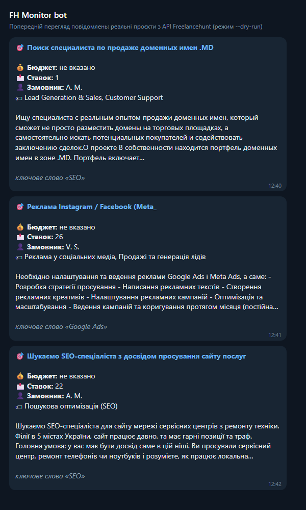

<<<<<<< HEAD
# 🤖 Freelancehunt Telegram Bot

Асинхронний Telegram-бот на Python для автоматичного моніторингу нових проєктів на біржі **Freelancehunt** та миттєвого надсилання сповіщень у Telegram.

---

## 📌 Основні можливості

- 🔄 **Автоматичний моніторинг**: Регулярний опит API Freelancehunt із настроюваним інтервалом.
- 🎯 **Фільтрація за замовленнями**: Збір проєктів за заданими категоріями та ключовими словами.
- 💾 **Захист від дублікатів**: Збереження опрацьованих ID проєктів у локальну базу даних **SQLite**.
- 🔔 **Зручні сповіщення**: Форматоване повідомлення в Telegram із назвою, бюджетом, описом та прямим посиланням на проєкт.
- ⚙️ **Гнучкий конфіг**: Усі токени та параметри збереження винесені в окремий `config.json`.

---

## 🛠 Технологічний стек

- **Мова**: Python 3.10+
- **Бібліотека Telegram**: `python-telegram-bot` / `aiogram`
- **Запити / API**: `requests` / `aiohttp`
- **База даних**: SQLite3
- **Конфігурація**: JSON

---

## 🚀 Інструкція зі встановлення та запуску

### 1. Клонування репозиторію

```bash
git clone [https://github.com/Kerunesh/portfolio.git](https://github.com/Kerunesh/portfolio.git)
cd portfolio/freelancehunt-bot
=======
# Freelancehunt → Telegram: монітор нових проєктів

Бот перевіряє нові проєкти на [Freelancehunt](https://freelancehunt.com) через офіційний API і надсилає в Telegram ті, що підходять за ключовими словами. Сайт не парситься, захист не обходиться.



## Можливості

- **Фільтр за ключовими словами та стоп-словами** у назві, описі й навичках проєкту. Слово шукається від початку слова: `бот` знайде «бота» і «ботів», але не «робота».
- **Чорний список замовників.** Персональні проєкти пропускаються.
- **Повідомлення в Telegram:** назва з посиланням, бюджет, кількість ставок, замовник, навички, початок опису і причина, з якої проєкт пройшов фільтр.
- **Без дублів.** Оброблені ID зберігаються в `data/state.json` і не надсилаються повторно після перезапуску.
- **Нічого не губиться.** API віддає по 10 проєктів на сторінку, тому бот гортає сторінки, доки не дійде до вже обробленого проєкту (`max_pages_per_check`).
- **Перший запуск не засипає чат.** Надсилаються лише `first_run_limit` найновіших збігів, решта позначається як переглянута.
- **Надійність:**
  - бот не падає, коли API Freelancehunt або Telegram недоступні;
  - мережеві помилки та 5xx повторюються з паузою;
  - ліміт Telegram (429) обробляється за `retry_after`;
  - проєкт, який не вдалося надіслати через тимчасову помилку, піде на наступній перевірці;
  - постійна помилка (невірний chat_id) не зациклює бота.
- **Токени не потрапляють у лог,** навіть у тексті помилок.
- Лог із ротацією: `logs/bot.log`, до 1 МБ × 3 файли.
- Лише стандартна бібліотека Python, нічого встановлювати не треба.

## Встановлення

Потрібен Python 3.8+.

```bash
git clone https://github.com/h3yskill-boop/portfolio.git
cd portfolio/freelancehunt-bot
cp config.example.json config.json      # Windows: copy config.example.json config.json
```

## Налаштування

1. **Telegram-бот.** Напишіть [@BotFather](https://t.me/BotFather) → `/newbot` → скопіюйте токен у `telegram_bot_token`.
2. **chat_id.** Напишіть своєму боту будь-яке повідомлення. Відкрийте `https://api.telegram.org/bot<ТОКЕН>/getUpdates`, візьміть `message.chat.id` і впишіть у `telegram_chat_id`. Для групи додайте бота в групу; id групи починається з `-100`.
3. **Токен Freelancehunt** (необов'язково, зменшує ризик ліміту запитів): Профіль → Налаштування → API, поле `freelancehunt_token`.
4. **Фільтри:** `keywords`, `stop_words`, `skip_employers` (ім'я та прізвище або логін). `skill_ids` — фільтр за ID навичок на боці API, наприклад `[96, 99]`.

Токени можна не писати у файл, а передати через змінні середовища `TELEGRAM_BOT_TOKEN`, `TELEGRAM_CHAT_ID`, `FH_TOKEN`. `config.json`, `data/` і `logs/` уже в `.gitignore`.

| Параметр | За замовчуванням | Що робить |
|---|---|---|
| `check_interval_seconds` | 300 | пауза між перевірками, не менше 60 |
| `max_pages_per_check` | 3 | скільки сторінок по 10 проєктів дивитись за одну перевірку |
| `first_run_limit` | 3 | скільки збігів надіслати при найпершому запуску |
| `skip_personal` | true | пропускати персональні проєкти |
| `state_file` / `log_file` | `data/state.json` / `logs/bot.log` | де зберігати ID і лог |

## Запуск

```bash
python bot.py --dry-run     # перевірити фільтри: збіги виводяться в консоль, нічого не надсилається і не зберігається
python bot.py               # робота в циклі, перевірка кожні 5 хвилин
python bot.py --once        # одна перевірка (для cron або Планувальника завдань)
python bot.py --verbose     # плюс причина пропуску кожного проєкту в лозі
```

**Linux, cron**: перевірка кожні 5 хвилин.

```cron
*/5 * * * * cd /opt/portfolio/freelancehunt-bot && /usr/bin/python3 bot.py --once
```

**Windows, Планувальник завдань**: створити завдання «Щодня», повторювати кожні 5 хвилин. Дія: `python.exe`, аргументи `bot.py --once`, робоча папка — папка бота.

## Тести

```bash
python -m unittest -v
```

25 тестів покривають:
- фільтри: межі слів, стоп-слова, чорний список;
- розбір відповіді API та екранування HTML;
- повтори при 429, 5xx і мережевих помилках;
- збереження ID після перезапуску;
- гортання сторінок і порядок надсилання;
- перший запуск і поведінку при падінні API або Telegram;
- приховування токенів у лозі.

## Структура

```
bot.py                      запуск, аргументи, логування
fh_monitor/config.py        читання й перевірка config.json
fh_monitor/freelancehunt.py клієнт API, модель проєкту
fh_monitor/filters.py       ключові слова, стоп-слова, чорний список
fh_monitor/telegram.py      формат повідомлення і відправка
fh_monitor/storage.py       збережені ID (атомарний запис JSON)
fh_monitor/monitor.py       одна перевірка: отримати → відфільтрувати → надіслати → запам'ятати
fh_monitor/net.py           HTTP-запити з повторами
tests/                      юніт-тести
```
>>>>>>> fec0501905de526d95b31def0c039e7d99f1c4ee
